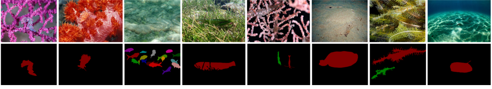
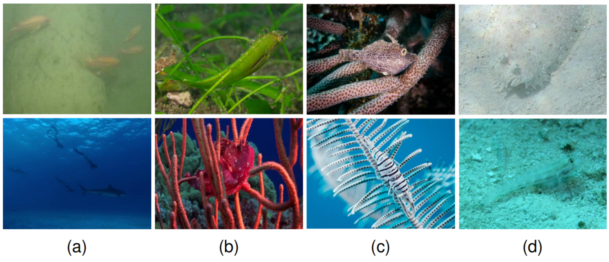
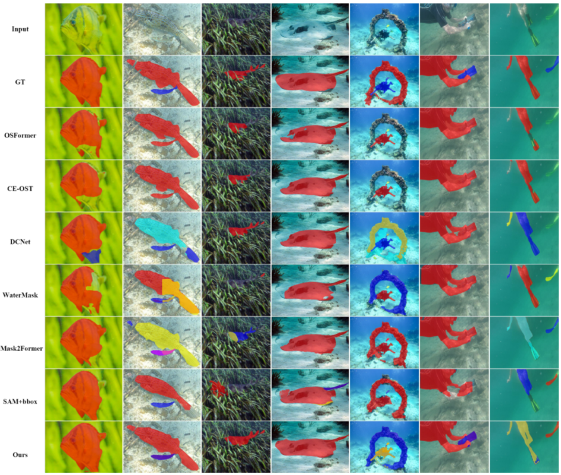

# UCIS-SAM on UCIS4K
Expose Camouflage in the Water: Underwater Camouflaged Instance Segmentation and Dataset
Source code and dataset for our paper “**[UCIS-SAM: Expose Camouflage in the Water: Underwater Camouflaged Instance Segmentation and Dataset]()**” by Chuhong Wang,  Hua Li, Huazhong Liu, Xiongxin Tang, and Sam Kwong. 

Created by **Chuhong Wang**, email: wangchuhong@hainanu.edu.cn

**! We are open to collaboration and are looking for self-motivated students. If you’re interested in this topic, please feel free to contact me via email.**

## UCIS4K dataset
**UCIS4K** is a **High-Quality** large-scale dataset consisting of **9000** images of underwater organisms from the public underwater datasets and images using camouflage-related keywords. <br> A total of **3953** images were selected by trained volunteers based on camouflage
characteristics. These images were then annotated at the pixel level, with the results validated through a voting process among the volunteers. 
Google drive: [UCIS4K](). **UCIS4K is free for academic research, not for any commercial purposes**.
<br>
**Note**: UCIS4K dataset includes camouflaged objects with similar colors and textures to the background,
blurred contours, small sizes, multiple objects, occlusion, complex contours, transparency, and underwater scenes with light and shadow effects.
## UCIS4K dataset Examples
Uncamouflaged objects appear unclear due to motion or backlighting in Fig.(a), Color camouflaged objects in Fig.(b), Texture camouflaged objects in Fig.(c), Edge blur camouflaged objects in Fig. (d).


## Benchmark
We compare the results with other instance segmentation methods on UCIS4K and UIIS dataset. From top to bottom: the original image is followed by ground truth and results of **[OSFormer](https://github.com/PJLallen/OSFormer)**, **CE-OST**, **DCNet**, **[WaterMask](https://github.com/LiamLian0727/WaterMask)**, **Mask2Former**, **SAM+bbox** and our **UCIS-SAM**. Each camouflaged instance is represented by a unique color. The first 4 columns are from our UCIS4K dataset, and the last 3 columns are from the UIIS dataset.

[**OSFormer**](J. Pei, T. Cheng, D.-P. Fan, H. Tang, C. Chen, and L. Van Gool,
“OSFormer: One-stage camouflaged instance segmentation with transformers,” in Proc. Eur. Conf. Comput. Vis. (ECCV). Springer, 2022,
pp. 19–37.)<br>
[**CE-OST**](T.-D. Nguyen, D.-T. Luu, V.-T. Nguyen, and T. D. Ngo, “CE-OST: Contour emphasis for one-stage transformer-based camouflage instance segmentation,” in Proc. Int. Conf. Multimedia Anal. Pattern Recognit. (MAPR). IEEE, 2023, pp. 1–6.)<br>
[**DCNet**](N. Luo, Y. Pan, R. Sun, T. Zhang, Z. Xiong, and F. Wu, “Camouflaged instance segmentation via explicit de-camouflaging,” in Proc. IEEE/CVF Conf. Comput. Vis. Pattern Recognit. (CVPR), 2023, pp. 17 918–17 927.)<br>
[**WaterMask**](S. Lian, H. Li, R. Cong, S. Li, W. Zhang, and S. Kwong, “Watermask:
Instance segmentation for underwater imagery,” in Proc. IEEE/CVF Int.
Conf. Comput. Vis. (ICCV), 2023, pp. 1305–1315.)<br>
[**Mask2Former**](B. Cheng, I. Misra, A. G. Schwing, A. Kirillov, and R. Girdhar,
“Masked-attention mask transformer for universal image segmentation,”
in Proc. IEEE/CVF Conf. Comput. Vis. Pattern Recognit. (CVPR), 2022,
pp. 1290–1299.)<br>
[**SAM+bbox**](A. Kirillov, E. Mintun, N. Ravi, H. Mao, C. Rolland, L. Gustafson, T. Xiao, S. Whitehead, A. C. Berg et al., “Segment anything,” in Proc. IEEE/CVF Int. Conf. Comput. Vis. (ICCV), 2023, pp. 4015–4026.)<br>


## Bibliography entry
If you think our work is helpful, please cite
```
@article{hong2025usis4k,
  title={Expose Camouflage in the Water: Underwater Camouflaged Instance Segmentation and Dataset},
  journal={},
  year={2025}
}
```

## Acknowledgement
We thank the developer of [OSFormer](https://github.com/PJLallen/OSFormer), [WaterMask](https://github.com/LiamLian0727/WaterMask), and [USIS-SAM]() for providing their open-source code, which greatly facilitated our benchmark evaluations.

## Note to active participants

**UCIS-SAM aims to jointly address two key challenges in accurately segmenting objects that blend closely with their surroundings. We hope UCIS4K can facilitate research within the fields of marine computer vision and marine robotics.** 
