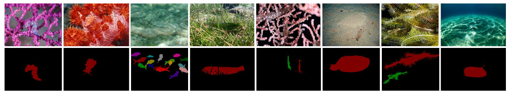
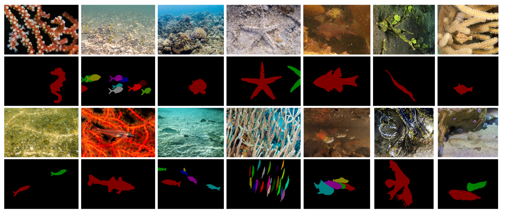
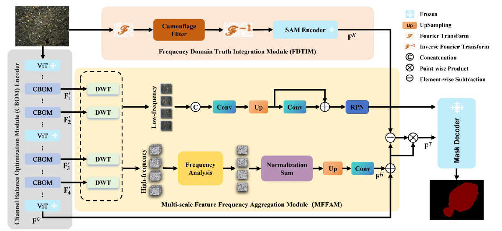
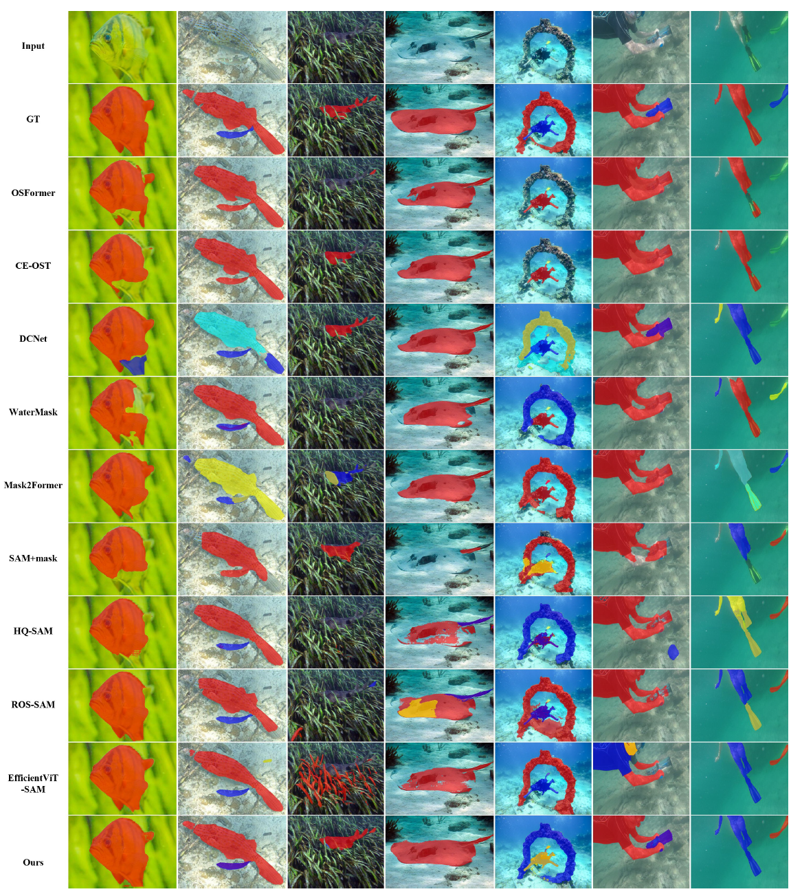

# Expose Camouflage in the Water: Underwater Camouflaged Instance Segmentation and Dataset

Source code and dataset for our paper “**[Expose Camouflage in the Water: Underwater Camouflaged Instance Segmentation and Dataset]()**”.


## 📦 UCIS4K Dataset

**UCIS4K** is the first dataset for underwater camouflaged instance segmentation, containing 3,953 annotated images. It captures diverse camouflaged organisms in underwater environments and highlights the unique characteristics of underwater camouflage.

📥 **Download**: [UCIS4K](https://drive.google.com/uc?export=download&id=1OysCLJpqoBM1SM2NQ3R0Wpq3tZMffvI0)  
⚠️ **License**: For academic research only (non-commercial use).

<p align="center">
  
</p>

🔍 **More Examples**
<p align="center">
  
</p>


## 🧠 UCIS-SAM Framework
We propose **UCIS-SAM** for the underwater camouflaged instance segmentation (CIS) task.

- **CBOM** is integrated into the SAM encoder to mitigate color distortion and improve feature learning for underwater domain adaptation.
- **FDTIM** reduces interference caused by high similarity between camouflaged objects and their surroundings.
- **MFFAM** enhances the boundaries of low-contrast camouflaged instances.

Comprehensive experiments on public benchmarks and the proposed **UCIS4K** dataset demonstrate the effectiveness of **UCIS-SAM**.

<p align="center">
  
</p>


## 📋 Requirements

- Python >= 3.8, PyTorch >= 2.1, CUDA >= 11.8  
- mmengine, mmcv >= 2.0.0, mmdetection >= 3.0  
- transformers, timm, opencv-python  

## 🛠️ Installation

```bash
conda env create -f environment.yml
conda activate ucis
pip install -r requirements.txt
```

## 🚀 Usage


### Configuration

Update the following paths in the config file:

```python
sam_pretrain_name = "/path/to/sam-vit-huge"
sam_pretrain_ckpt_path = "/path/to/sam-vit-huge/pytorch_model.bin"
data_root = "/path/to/UCIS4K/"
```


Download SAM (ViT-H) weights from the official repository [SAM Model Checkpoints](https://github.com/facebookresearch/segment-anything).  
Download the dataset from [UCIS4K](https://drive.google.com/uc?export=download&id=1OysCLJpqoBM1SM2NQ3R0Wpq3tZMffvI0).


### Training
#### Single GPU
```bash
python tools/train.py project/our/configs/foreground_ucis_train_cosine.py
```
#### Multi-GPU
```bash
bash tools/dist_train.sh project/our/configs/foreground_ucis_train_cosine.py 2
```
### Testing
```bash
python tools/test.py \
  project/our/configs/foreground_ucis_train_cosine.py \
  checkpoints/your_checkpoint.pth
```


## 📊 Results

| Method | Dataset | AP | AP50 | AP75 | weight |
|--------|--------|----|----------|-----|------|
| UCIS-SAM | UCIS4K | 54.0 | 77.8 | 59.6 |[google]()|

**Qualitative results:**
Comparison with other segmentation methods on UCIS4K and UIIS datasets. Each camouflaged instance is represented by a unique color. The first 4 columns are from our UCIS4K dataset, and the last 3 columns are from the UIIS dataset.

<p align="center">
  
</p>


## 📜 Citation
If you find our work useful, please cite:
```
@misc{wang2025exposecamouflagewaterunderwater,
      title={Expose Camouflage in the Water: Underwater Camouflaged Instance Segmentation and Dataset}, 
      author={Chuhong Wang and Hua Li and Chongyi Li and Huazhong Liu and Xiongxin Tang and Sam Kwong},
      year={2025},
      eprint={2510.17585},
      archivePrefix={arXiv},
      primaryClass={cs.CV},
      url={https://arxiv.org/abs/2510.17585}, 
}
```

## Acknowledgement
This repository is built upon the [MMDetection](https://github.com/open-mmlab/mmdetection) framework and [Segment Anything Model](https://huggingface.co/facebook/sam-vit-huge). Some codes are adapted from [USIS10K](https://github.com/LiamLian0727/USIS10K) and [Mask2Former](https://github.com/facebookresearch/Mask2Former). We sincerely thank the authors for their excellent work.

