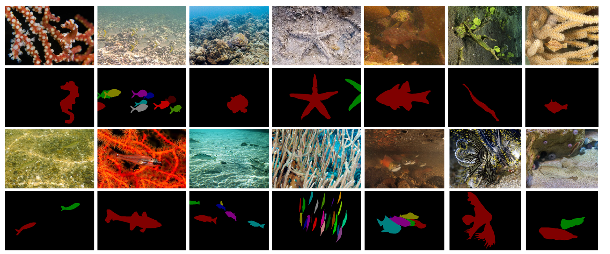

# Expose Camouflage in the Water: Underwater Camouflaged Instance Segmentation and Dataset

Source code and dataset for our paper “**[Expose Camouflage in the Water: Underwater Camouflaged Instance Segmentation and Dataset]()**”.


## UCIS4K dataset
**UCIS4K** is the first dataset for the underwater camouflaged instance segmentation task. It comprises 3,953 images with instance-level annotations, featuring a diverse array of marine organisms, including fish, shrimp, crabs, and seahorses, across various camouflage scenarios.

Google drive: [UCIS4K](). **UCIS4K is free for academic research, not for any commercial purposes**.
<br>
**Note**: UCIS4K dataset includes camouflaged objects with similar colors and textures to the background,
blurred contours, small sizes, multiple objects, occlusion, complex contours, transparency, and underwater scenes with light and shadow effects.
## More Examples
More visual samples of annotated images in UCIS4K. The images at the top are the original images and those at the bottom are the annotation
masks, different colors represent different camouflaged instances.


## Benchmark
We compare the results with other instance segmentation methods on UCIS4K and UIIS datasets. From top to bottom: the original image is followed by ground truth and results of **[OSFormer](https://github.com/PJLallen/OSFormer)**, **CE-OST**, **DCNet**, **[WaterMask](https://github.com/LiamLian0727/WaterMask)**, **Mask2Former**, **SAM+bbox** and our **UCIS-SAM**. Each camouflaged instance is represented by a unique color. The first 4 columns are from our UCIS4K dataset, and the last 3 columns are from the UIIS dataset.


## Bibliography entry
If you think our work is helpful, please cite
```
@misc{wang2025exposecamouflagewaterunderwater,
      title={Expose Camouflage in the Water: Underwater Camouflaged Instance Segmentation and Dataset}, 
      author={Chuhong Wang and Hua Li and Chongyi Li and Huazhong Liu and Xiongxin Tang and Sam Kwong},
      year={2025},
      eprint={2510.17585},
      archivePrefix={arXiv},
      primaryClass={cs.CV},
      url={https://arxiv.org/abs/2510.17585}, 
}
```

## Acknowledgement
We thank the developer of [OSFormer](https://github.com/PJLallen/OSFormer), [WaterMask](https://github.com/LiamLian0727/WaterMask), and [USIS-SAM]() for providing their open-source code, which greatly facilitated our benchmark evaluations.

## Note to active participants

**UCIS-SAM aims to jointly address two key challenges in accurately segmenting objects that blend closely with their surroundings. We hope UCIS4K can facilitate research within the fields of marine computer vision and marine robotics.** 
